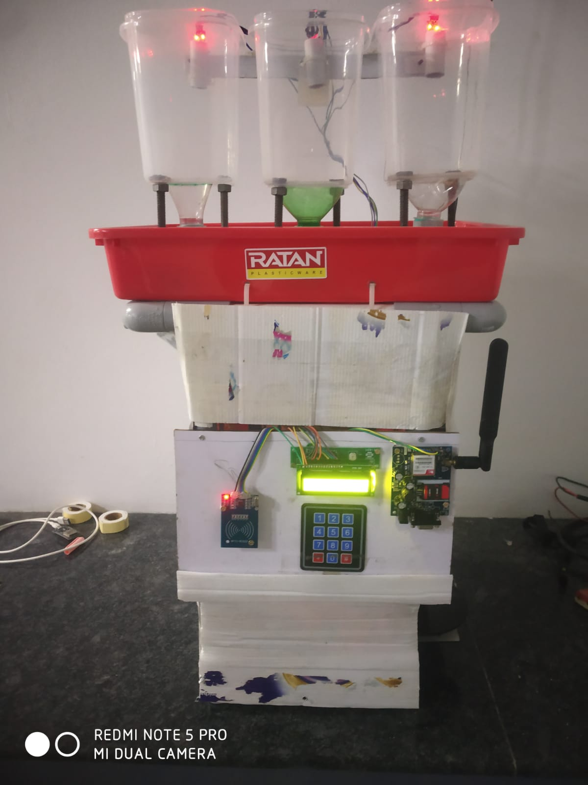

# Automated Embedded System for Smart Grocery Vending Machine

## Overview

The Smart Grocery Vending Machine is an embedded system designed to automate the dispensing of grocery items with accurate weight measurement and billing. The system integrates STM32, ESP32, RFID, GSM, and Load Cell technologies to provide a smart, efficient, and user-friendly vending solution.

---

## Features

- Automated grain dispensing using Screw Conveyor mechanism
- Accurate weight measurement using Load Cell and HX711
- RFID-based customer authentication
- GSM-based SMS bill notification
- LCD display for user interaction
- Keypad-based quantity selection
- Inventory monitoring
- Automatic bill calculation

---

## Hardware Components

- STM32 Nucleo F401RE (ARM Cortex-M4)
- ESP32 Wi-Fi Microcontroller
- RFID Reader (RC522)
- GSM Module (SIM800L / SIM900A)
- Load Cell (1 kg) with HX711
- 4×3 Matrix Keypad
- 16×2 LCD Display
- 12V PMDC Gear Motor
- Screw Conveyor Mechanism
- IR Sensor
- Buck Converter (12V to 5V)
- SMPS Power Supply
- UART Serial Communication

---

## Software & Tools

- STM32CubeIDE
- Embedded C
- Arduino IDE
- STM32 HAL Libraries

---

## Working

1. User authenticates using an RFID card.
2. The desired grocery item and quantity are selected using the keypad.
3. The screw conveyor dispenses the selected grain.
4. The load cell continuously measures the dispensed weight.
5. The LCD displays weight and price in real time.
6. The final bill is calculated automatically.
7. A confirmation SMS is sent through the GSM module.

---

## Project Prototype

---
## 🎥 Project Demonstration

The project demonstration videos are available here:

- [Demo Videos](VIDEOS.md)

---

## Technologies Used

- Embedded Systems
- Embedded C
- STM32
- ESP32
- IoT
- RFID
- GSM Communication
- UART Communication
- Load Cell (HX711)
- Sensor Interfacing

---
## Research Publication

This project was presented as a research paper at the **5th International Conference on Advances in Science, Engineering & Technology (ICASET 2026)**.

**Paper Title:**
Automated Embedded System for Grocery Vending Machine

---

## My Contribution

- Designed and developed the embedded system.
- Integrated STM32, ESP32, RFID, GSM, Load Cell, LCD, Keypad, and Screw Conveyor.
- Developed the firmware for automatic dispensing, weight measurement, billing, and SMS notification.
- Tested and validated the complete hardware-software integration.

---

## Future Enhancements

- UPI / QR Code Payment
- Mobile Application Integration
- Cloud-based Inventory Monitoring
- AI-based Stock Prediction

---

## Author

**Keerthana Srinivasan**

B.E. Electronics and Communication Engineering

Kongu Engineering College
